<div align="center">


<a href="https://github.com/ariefbsusilo">
  
</a>

<br/>


</div>

<br/>



---

## `>_ whoami`

```python
from dataclasses import dataclass, field

@dataclass
class AriefBSusilo:
    role: tuple = ("AI Engineer", "Data Scientist", "Photographer")
    location: str = "Yogyakarta, Indonesia 🇮🇩"

    currently_building: str = "AI System Automation 🤖"
    currently_learning: list = field(default_factory=lambda: [
        "Advanced Deep Learning",
        "AI Engineering & LLM Agents",
    ])
    hobbies: list = field(default_factory=lambda: [
        "📸 Capturing moments through the lens",
        "⚙️  Automating boring tasks",
    ])

    def mission(self) -> str:
        return "Building intelligent systems that see, reason, and act."

me = AriefBSusilo()
print(me.mission())
```



---

## `>_ tech_stack.load()`

<table align="center">
<tr>
<td align="center" width="25%"><b>🧠 AI / ML</b></td>
<td>
  
  
  
  
  
  
</td>
</tr>
<tr>
<td align="center"><b>📊 Data</b></td>
<td>
  
  
  
  
  
</td>
</tr>
<tr>
<td align="center"><b>⚙️ Automation</b></td>
<td>
  
  
  
  
</td>
</tr>
<tr>
<td align="center"><b>📸 Visual</b></td>
<td>
  
  
</td>
</tr>
</table>

---

## `>_ metrics.plot()`

<div align="center">

<picture>
  <source media="(prefers-color-scheme: dark)" srcset="https://raw.githubusercontent.com/ariefbsusilo/ariefbsusilo/output/snake-dark.svg" />
  
</picture>


</div>

---

<div align="center">

```diff
+ while(alive): learn(); build(); automate(); repeat()
```


</div>
